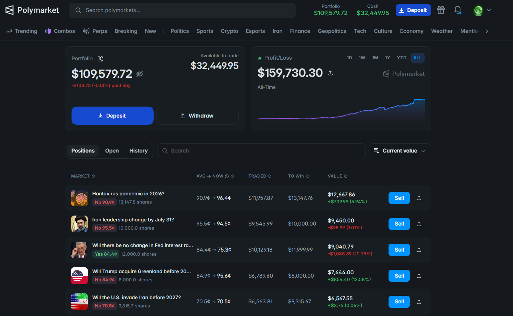
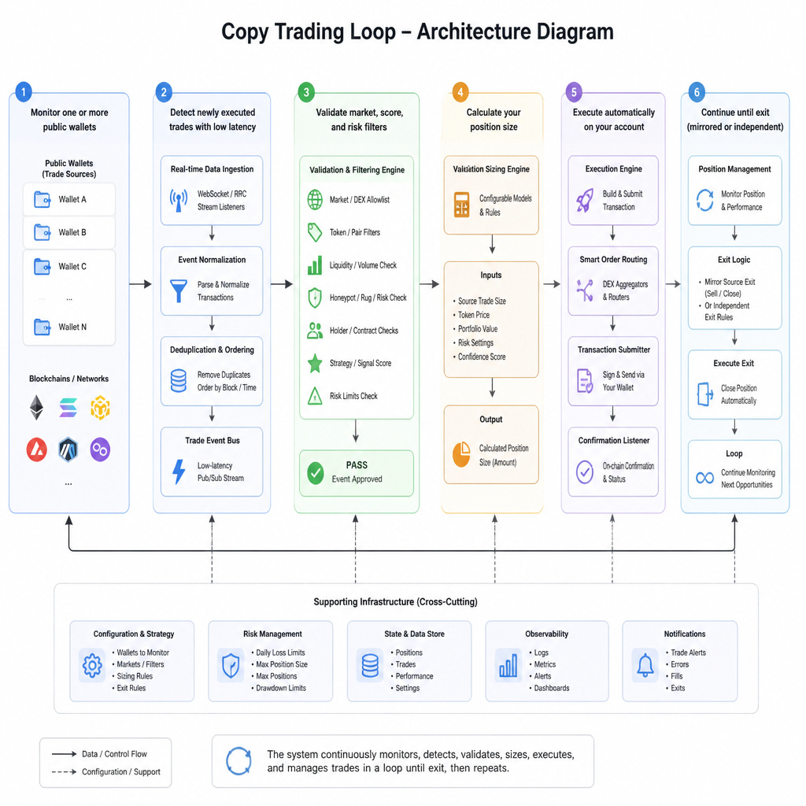
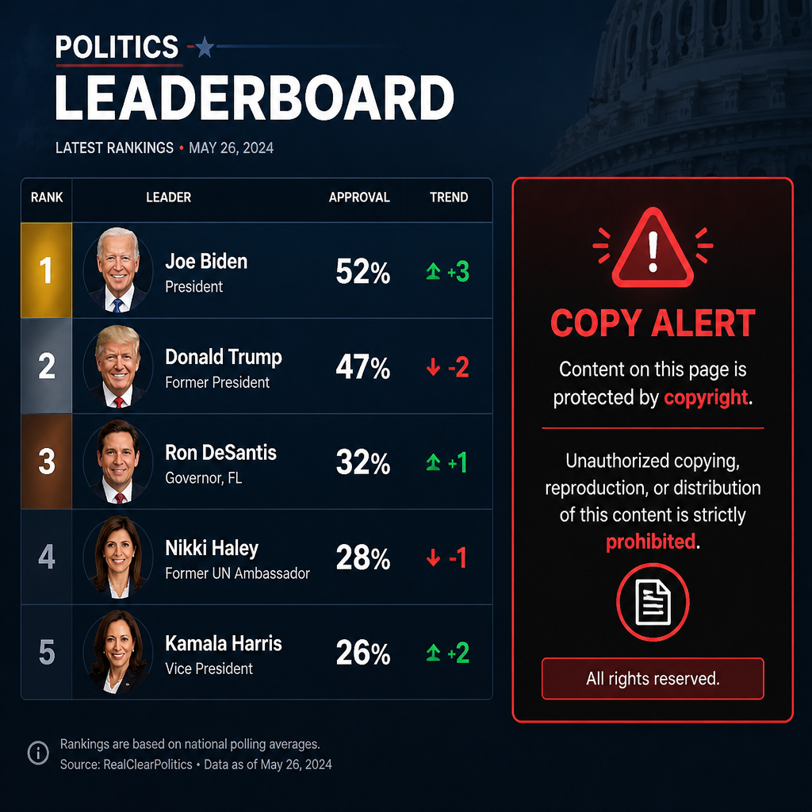
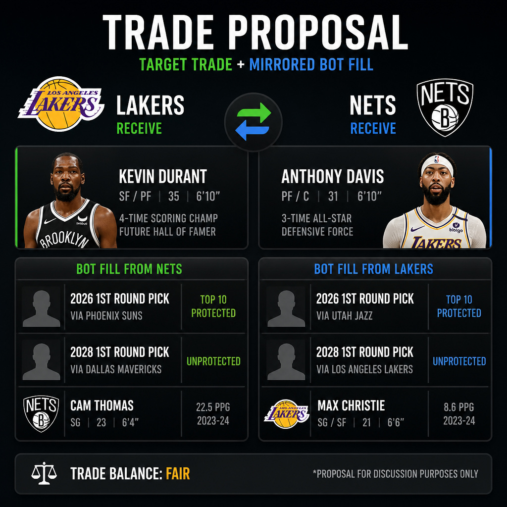

# Polymarket Trading Bot | Polymarket Copy Trading Bot Tools & Services

**Language / 语言 / Язык:** English | [中文](README.zh-CN.md) | [Русский](README.ru.md)

Professional **Polymarket copy trading bot tools and services** for automated mirroring of top wallets across **real-world event markets** — politics, sports, weather, crypto, economics, entertainment, and more.

I build, deploy, and support copy systems that watch selected “smart money” addresses in real time, detect new trades with **low latency** (mempool / on-chain monitoring — not slow API polling alone), then size and execute on **your** wallet with filters, allocation rules, and optional **TP/SL** — not blind one-for-one cloning.


**Live profile:** [**@moond on Polymarket**](https://polymarket.com/@moond)

**Telegram:** [@cryptomoonday23](https://t.me/cryptomoonday23) · **Discord:** cryptomoonday · **Author:** [@cryptomoonday](https://github.com/cryptomoonday)

---

## Markets We Serve

Copy trading works on any public Polymarket category your leaders trade. Tooling and custom services are available for:

| Category | Example markets | Typical copy focus |
|----------|-----------------|-------------------|
| **Politics** | Elections, primaries, nominations, legislation, geopolitics | Specialist wallets, nested-event conviction, news-lag leaders |
| **Sports** | NBA / NFL / soccer moneyline, spreads, series, tournaments | Live specialists, late-game snipers, category-filtered copy |
| **Weather** | Temperature thresholds, storms, hurricanes, rainfall | Model-driven leader wallets, avoid casual noise |
| **Crypto** | Price thresholds, Up/Down windows, ETF / protocol events | Latency leaders, endcycle snipers, short-window filters |
| **Economics / Macro** | Fed cuts, CPI, unemployment, GDP prints | Calendar specialists, catalyst wallets |
| **Business / Tech** | Earnings, product launches, M&A, IPO odds | Headline-speed traders, selective signal copy |
| **Culture / Entertainment** | Awards, box office, viral events | Thin-book specialists with dust filters |
| **World / Other** | Conflict timelines, science, custom event contracts | Multi-wallet portfolios by niche |

<!-- IMAGE PLACEHOLDER: 8-category markets grid for copy trading (politics/sports/weather/crypto/…). Suggested file: doc/markets-grid.png -->


---

## What I Offer (Tools & Services)

- **Ready copy-trading modules** — detect → filter → size → execute → exit
- **Custom builds** for your niche (politics desks, sports live copy, crypto short windows, multi-leader portfolios)
- **Smart wallet scoring** — win rate, ROI, diversity, recency before a leader enters your pool
- **Sizing engines** — fixed, proportional, adaptive / risk-capped
- **Execution quality** — slippage caps, limit offsets, dust filters, category allow/block lists
- **Exit control** — mirror leader sells and/or independent TP/SL
- **Monitoring & alerts** (Telegram / Discord) for copies, skips, drawdowns, leader ejection
- **Consulting** on leader selection, VPS/RPC, wallet setup, and risk budgets

<!-- IMAGE PLACEHOLDER: Services pipeline — You → Watch leaders → Filter → Size → Execute → Exit/TP-SL. Suggested file: doc/services-pipeline.png -->


If you want a **single-leader** copier or a **multi-wallet portfolio** across Polymarket verticals, reach out on Telegram: [@cryptomoonday23](https://t.me/cryptomoonday23) or Discord: **cryptomoonday**.

---

## Features

- **Real-time wallet mirroring** of public Polymarket traders
- **Low-latency detection** via mempool / on-chain activity (faster than API-only polling)
- Combined strategy layer: **trade-size determination & allocation** + optional **TP/SL**
- Fixed, proportional, and risk-capped position sizing
- Multi-wallet tracking with per-leader and portfolio exposure limits
- Market / category filters, dust filters, and slippage controls
- Buy-only or full buy+sell mirroring across politics, sports, crypto, and more
- Proven target → copy activity with public screenshots
- Deep catalog of standing **copy trading strategies** used on Polymarket in 2026

---

## Strategy Catalog (Copy Trading)

Polymarket is public and on-chain — wallet activity is visible. Copy bots turn that into automation: detect → qualify → size → execute. Blind mirroring every fill is the beginner trap. Serious systems compete on **who** they follow, **which** trades they take, **how** they size, and **how fast** they fill.

| # | Strategy | Style | Typical edge |
|---|----------|-------|--------------|
| 1 | **Smart / Scored Wallet Copy** | Quality-filtered leaders | Only follow wallets that pass win-rate / ROI / diversity filters |
| 2 | **Selective Signal Copy** | Per-trade scoring | Copy only high-conviction fills, skip noise |
| 3 | **Full Mirror Copy** | Blind mirror | Copy every buy/sell from a chosen wallet |
| 4 | **Proportional Sizing Copy** | Scale to bankroll | Match % of leader size or your equity |
| 5 | **Fixed Size Copy** | Flat stake | Same USD per copied trade |
| 6 | **Adaptive / Risk-Capped Copy** | Hard caps | Size then clamp to max per trade / market / day |
| 7 | **Multi-Wallet Portfolio Copy** | Diversified leaders | Follow several traders with portfolio limits |
| 8 | **Consensus Multi-Leader Copy** | Agreement filter | Enter only when multiple leaders align |
| 9 | **Exit Mirror vs Independent TP/SL** | Exit control | Mirror sells, or exit on your own rules |
| 10 | **Category / Market Filtered Copy** | Domain focus | Politics-only, sports-only, crypto-only, etc. |
| 11 | **Latency-First / Mempool Copy** | Speed | Detect on-chain early to reduce slippage lag |
| 12 | **Time-Window Filtered Copy** | Early / late only | Copy only first N seconds or last N seconds of short markets |
| 13 | **Buy-Only vs Buy+Sell Mirror** | Direction of copy | Entries only, or full open/close lifecycle |
| 14 | **Limit Offset / Slippage-Controlled Copy** | Execution quality | Limit with price offset, max slippage, FAK guards |
| 15 | **Dust / Min-Trade Filter Copy** | Anti-noise | Ignore tiny leader trades that waste fees |

<!-- IMAGE PLACEHOLDER: Strategy catalog visual — 15 copy-strategy tiles. Suggested file: doc/strategy-catalog.png -->


---

## Contact

I provide **Polymarket copy trading bot tools and services** across many market types. Whether you need a politics smart-money follower, a live sports category filter, a crypto endcycle copy overlay, or a full multi-leader stack — I can help design, ship, and tune it.

| Channel | Link |
|---------|------|
| **Telegram** | [@cryptomoonday23](https://t.me/cryptomoonday23) |
| **Discord** | cryptomoonday |
| **GitHub** | [@cryptomoonday](https://github.com/cryptomoonday) |
| **Polymarket** | [@moond](https://polymarket.com/@moond) |

Public live account:

**https://polymarket.com/@moond**

<!-- IMAGE PLACEHOLDER: Contact CTA — Telegram @cryptomoonday23 + Discord cryptomoonday + Polymarket @moond. Suggested file: doc/contact-cta.png -->
<!--  -->

---

## Live Proof — Target → Copy Cycles

These screenshots show the copy loop in practice: a **target wallet** trades, and the **bot account** mirrors with configured sizing and rules.

### Copy trading instance

<table>
<tr>
<td width="50%" valign="top">

**Target activity**


</td>
<td width="50%" valign="top">

**Bot account copying**


</td>
</tr>
</table>

### Profile & PnL screenshots

Live dashboard growth and copy activity across markets (including sports / event markets):


<!-- IMAGE PLACEHOLDER: @moond profile overview if used for copy desk. Suggested file: doc/moond-profile.png -->
<!--  -->

Trade history includes repeated mirrored entries across sports, crypto, politics, and event markets — followed through to settlement or rule-based exits.

---

## How Copy Trading Works (Core Loop)

```
Target wallet(s)
      │
      ▼
 Detect new trade (mempool / activity feed / CLOB)
      │
      ▼
 Validate filters (market, size, score, risk, slippage)
      │
      ▼
 Calculate position size (fixed / % / adaptive)
      │
      ▼
 Submit order on your wallet
      │
      ▼
 Monitor → mirror exit or apply TP/SL
```

Whenever a tracked wallet opens (or closes) a position:

1. Monitor one or more public wallets
2. Detect newly executed trades with low latency
3. Validate market, score, and risk filters
4. Calculate your position size
5. Execute automatically on your account
6. Continue until exit (mirrored or independent)

<!-- IMAGE PLACEHOLDER: Architecture diagram of the copy loop above. Suggested file: doc/architecture-stack.png -->
<!--  -->

---

## Why Polymarket Copy Trading Matters in 2026

Polymarket’s open order flow and public wallets created a “smart money” layer across **every event category**:

- Top traders publish edge through **on-chain fills**, not private signals
- Manual following is too slow — books move while you click
- Copy bots automate detect → filter → size → execute **24/7**
- The real competition is no longer “can you copy?” — it is **can you copy well?**

Industry patterns across Telegram copiers, hosted platforms, and open-source engines:

- Blind mirroring copies **noise** (dust trades, hedges, inventory dumps)
- Scored / selective copy improves expected quality by skipping low-signal fills
- Proportional sizing keeps risk aligned across different bankrolls
- Latency and slippage decide whether you get the leader’s price — or a worse one
- Exit policy (mirror vs own TP/SL) often matters as much as entry

That is why modern Polymarket copy systems are **strategy stacks**, not a single “follow this whale” toggle.

---

## Core Strategy Playbooks

### 1. Smart / Scored Wallet Copy

Score candidate wallets before they enter your copy pool:

| Criterion | What it measures | Why it matters |
|-----------|------------------|----------------|
| **Win rate** | % of resolved positions that were profitable | Filters coin-flip gamblers |
| **Average ROI** | Mean return per resolved market | Filters high-volume low-edge traders |
| **Market diversity** | Categories / unique markets traded | Avoids one-niche luck streaks |
| **Recency** | Days since last active trade | Drops dead or retired wallets |
| **Calibration** | Did their prices match outcomes over time? | Separates skill from luck |

Dynamic pool: add wallets that pass; eject wallets that decay; alert on Telegram/Discord when a leader is dropped.

### 2. Selective Signal Copy

Even a great wallet places mediocre trades. Score each fill (market type, relative size, timing, book quality) and copy only high-conviction signals.

### 3. Full Mirror Copy

Pick a wallet and mirror every buy/sell. Simple baseline — usually needs sizing caps and dust filters on top.

### 4–6. Sizing: Proportional / Fixed / Adaptive

| Mode | Idea | Example |
|------|------|---------|
| **Proportional** | Copy risk share | Leader buys $1,000 → you buy 10% = $100 |
| **Fixed** | Same USD every signal | Always $50 per qualifying trade |
| **Adaptive** | Compute then clamp | Calculated $320 → max $100 → execute $100 |

Hard guards: max per trade, per market, per hour/day, max open positions, daily loss / drawdown breaker.

### 7–8. Multi-Wallet & Consensus

Follow **3–7 specialists** with per-wallet caps. Optional consensus: only enter when multiple leaders take the same side within a time window.

### 9. Exit Mirror vs Independent TP/SL

| Mode | Behavior |
|------|----------|
| **Mirror exits** | When the leader sells/reduces, you do too |
| **Independent TP/SL** | Your own take-profit / stop-loss / time-stop |
| **Hybrid** | Mirror by default + hard SL / daily breaker + optional TP |

Featured approach: **size determination + optional TPSL**, not pure blind exit inheritance.

### 10–12. Filters: Category, Latency, Time-Window

- **Category filters** — only politics / sports / crypto / … niches where the leader has edge
- **Latency-first / mempool** — detect on-chain early so you don’t copy a worse price of the same idea
- **Time-window** — early sniper window or late endcycle window on short markets (5m/15m)

### 13–15. Lifecycle & Execution Quality

- **Buy-only** vs **buy+sell** mirror (`COPY_SELLS` style control)
- **Limit offset / max slippage / FAK** — never chase infinitely
- **Dust / min-trade filter** — ignore leader fills below e.g. $10–$50

---

## Strategies by Market Category

### Politics

Follow election / legislation specialists; use nested-event conviction filters; skip dust; prefer selective signal copy around polls and breaking news.

<!-- IMAGE PLACEHOLDER: Politics leader board + copy alert. Suggested file: doc/politics-copy.png -->
<!--  -->

### Sports

Category-filter to sports wallets; optional late-game / live-only time windows; size to book depth; independent TP/SL during chaotic live minutes.

<!-- IMAGE PLACEHOLDER: Sports target trade + mirrored bot fill. Suggested file: doc/sports-copy.png -->
<!--  -->

### Weather

Only copy leaders with proven model-driven histories; dust filters critical; avoid copying casual retail weather bets.

### Crypto

Latency-first detection matters most; optional endcycle time filter; proportional sizing on short Up/Down windows.

### Macro / Business / Culture

Calendar specialists and headline wallets; selective signal scores; thin-book slippage caps for culture markets.

---

## How These Copy Strategies Fit Together

| Layer | Strategies |
|-------|------------|
| **Leader selection** | Smart / scored wallet copy, multi-wallet portfolio |
| **Signal quality** | Selective signal copy, consensus multi-leader, dust filters |
| **Sizing** | Proportional, fixed, adaptive risk caps |
| **Domain control** | Category / market filters, time-window filters |
| **Detection speed** | Latency-first / mempool copy |
| **Execution** | Limit offset / slippage controls |
| **Exits** | Exit mirror and/or independent TP/SL |
| **Lifecycle** | Buy-only vs buy+sell mirror |

---

## Why Work With Me

This project helps traders get real **Polymarket copy trading bot tools and services** across the full event spectrum:

- Not locked to crypto-only leaders
- Politics, weather, sports, crypto, macro, and more — **all available**
- Clear strategy maps so you know what you’re buying
- Low-latency detection + sizing + optional TP/SL
- Live proof of target → copy behavior
- Live profile: [@moond](https://polymarket.com/@moond)

Telegram: [@cryptomoonday23](https://t.me/cryptomoonday23) · Discord: **cryptomoonday**

<!-- IMAGE PLACEHOLDER: Closing CTA — “Copy Smart Money Across Every Polymarket Category”. Suggested file: doc/closing-cta.png -->
<!--  -->

---

## Risks & Disclaimer

- **Copy trading is not passive income** — leaders lose, style-drift, and get copied into oblivion
- **Slippage & latency** mean your fill ≠ their fill
- **Past leader P&L does not guarantee** your future results
- **Filters can skip winners** and still catch losers — no filter is perfect
- **Past results are not future guarantees** — [@moond](https://polymarket.com/@moond) is illustration, not a promise
- **Not financial advice** — prediction markets involve substantial risk of loss

Use only capital you can afford to lose.

---

## Roadmap

- Stronger wallet scoring & automatic leader ejection
- Per-trade selective signal filters
- Multi-wallet portfolio caps and consensus mode
- Richer TP/SL and exit-mirror hybrids
- Category packs (politics / sports / crypto / weather)
- Telegram + Discord ops suite (alerts, pauses, per-market kill switches)
- Real-time analytics dashboard
- Cloud deployment automation

---

## SEO Keywords

Polymarket copy trading bot, Polymarket copy bot tools, Polymarket copy trading services, smart money copy trading, wallet mirror bot, Polymarket leaderboard copy, proportional copy trading, fixed size copy bot, multi-wallet copy trading, TP/SL copy trading, mempool copy trading, politics copy trading Polymarket, sports copy trading bot, prediction market copy trading, automated Polymarket mirroring

---

## License

ISC License
