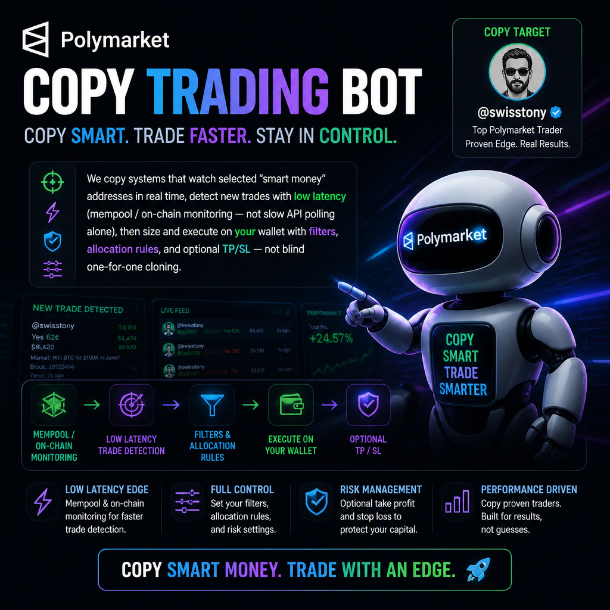
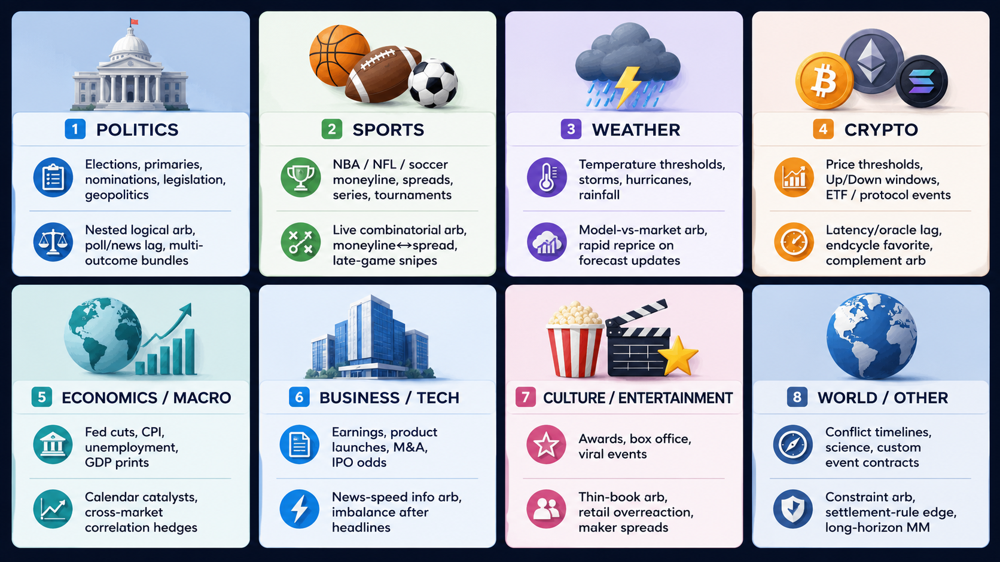
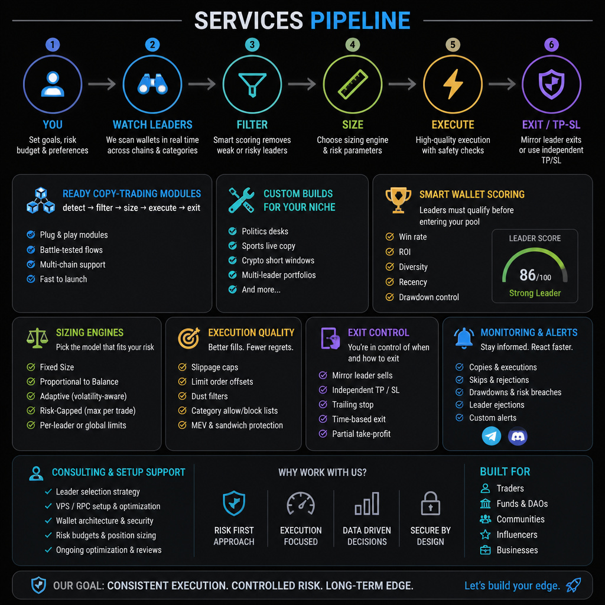
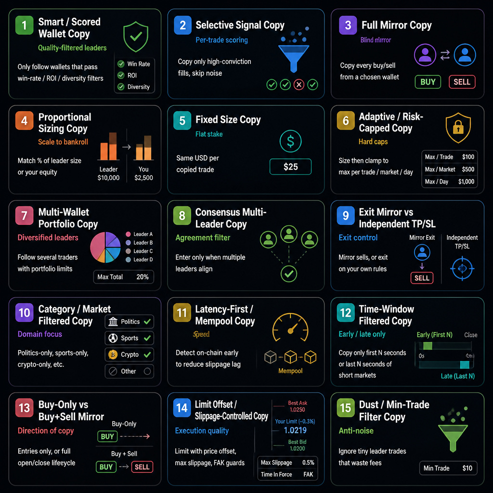

# Polymarket Trading Bot | Инструменты и сервисы copy trading ботов Polymarket

**Язык / Language / 语言:** [English](README.md) | [中文](README.zh-CN.md) | Русский

Профессиональные **инструменты и сервисы copy trading ботов Polymarket** для автоматического зеркалирования топ-кошельков на **рынках реальных событий** — политика, спорт, погода, крипто, экономика, развлечения и другое.

Я создаю, внедряю и сопровождаю copy-системы, которые в реальном времени следят за выбранными «smart money» адресами, детектируют новые сделки с **низкой latency** (mempool / on-chain — не только медленный API polling), затем сайзят и исполняют на **вашем** кошельке с фильтрами, правилами аллокации и опциональным **TP/SL** — не слепое клонирование 1:1.



**Живой профиль:** [**@moond on Polymarket**](https://polymarket.com/@moond)

**Telegram:** [@cryptomoonday23](https://t.me/cryptomoonday23) · **Discord:** cryptomoonday · **Автор:** [@cryptomoonday](https://github.com/cryptomoonday)

---

## Рынки, которые мы обслуживаем

Copy trading работает на любой публичной категории Polymarket, где торгуют ваши лидеры. Инструменты и кастомные сервисы доступны для:

| Категория | Примеры рынков | Фокус copy |
|-----------|----------------|------------|
| **Политика** | Выборы, праймериз, номинации, законы, геополитика | Специалисты, nested conviction, news-lag лидеры |
| **Спорт** | NBA / NFL / футбол moneyline, спреды, серии, турниры | Live-специалисты, late-game snipers, category filters |
| **Погода** | Пороги температуры, штормы, ураганы, осадки | Model-driven лидеры, фильтр casual noise |
| **Крипто** | Пороги цены, Up/Down окна, ETF / protocol events | Latency-лидеры, endcycle snipers, short-window filters |
| **Экономика / макро** | Fed cuts, CPI, безработица, GDP | Calendar specialists, catalyst wallets |
| **Бизнес / Tech** | Earnings, запуски продуктов, M&A, IPO odds | Headline-speed traders, selective signal copy |
| **Культура / Entertainment** | Премии, касса, вирусные события | Thin-book специалисты + dust filters |
| **Мир / другое** | Конфликты, наука, кастомные event-контракты | Multi-wallet портфели по нишам |

<!-- IMAGE PLACEHOLDER: Сетка категорий. Файл: doc/markets-grid.png -->
<!--  -->

---

## Что я предлагаю (Tools & Services)

- **Готовые copy-модули** — detect → filter → size → execute → exit
- **Кастомные сборки** (политика, live-спорт, crypto short windows, multi-leader портфели)
- **Smart wallet scoring** — win rate, ROI, diversity, recency
- **Sizing engines** — fixed, proportional, adaptive / risk-capped
- **Execution quality** — slippage, limit offsets, dust filters, allow/block lists
- **Exit control** — mirror sells и/или независимый TP/SL
- **Мониторинг и алерты** (Telegram / Discord)
- **Консалтинг** по выбору лидеров, VPS/RPC, кошелькам и risk budgets

<!-- IMAGE PLACEHOLDER: Пайплайн сервисов. Файл: doc/services-pipeline.png -->
<!--  -->

Нужен **single-leader** copier или **multi-wallet портфель** — пишите в Telegram: [@cryptomoonday23](https://t.me/cryptomoonday23) или Discord: **cryptomoonday**.

---

## Возможности

- Real-time зеркалирование публичных трейдеров Polymarket
- Low-latency detection через mempool / on-chain
- Size determination & allocation + опциональный TP/SL
- Fixed / proportional / risk-capped sizing
- Multi-wallet tracking с лимитами экспозиции
- Category / dust / slippage фильтры
- Buy-only или полный buy+sell mirror
- Доказательства target → copy
- Каталог copy-стратегий Polymarket 2026

---

## Каталог стратегий (Copy Trading)

| # | Стратегия | Стиль | Типичный край |
|---|-----------|-------|---------------|
| 1 | **Smart / Scored Wallet Copy** | Quality-filtered leaders | Только кошельки, прошедшие win-rate / ROI / diversity |
| 2 | **Selective Signal Copy** | Per-trade scoring | Только high-conviction fills |
| 3 | **Full Mirror Copy** | Blind mirror | Каждая покупка/продажа выбранного кошелька |
| 4 | **Proportional Sizing Copy** | Scale to bankroll | % от размера лидера или вашего equity |
| 5 | **Fixed Size Copy** | Flat stake | Один и тот же USD на сигнал |
| 6 | **Adaptive / Risk-Capped Copy** | Hard caps | Сайз, затем clamp к лимитам |
| 7 | **Multi-Wallet Portfolio Copy** | Diversified leaders | Несколько трейдеров + portfolio limits |
| 8 | **Consensus Multi-Leader Copy** | Agreement filter | Вход только при согласии нескольких лидеров |
| 9 | **Exit Mirror vs Independent TP/SL** | Exit control | Mirror sells или свои правила |
| 10 | **Category / Market Filtered Copy** | Domain focus | Только politics / sports / crypto и т.д. |
| 11 | **Latency-First / Mempool Copy** | Speed | Ранний on-chain детект |
| 12 | **Time-Window Filtered Copy** | Early / late only | Только первые/последние N секунд коротких рынков |
| 13 | **Buy-Only vs Buy+Sell Mirror** | Direction of copy | Только входы или полный lifecycle |
| 14 | **Limit Offset / Slippage-Controlled Copy** | Execution quality | Offset, max slippage, FAK |
| 15 | **Dust / Min-Trade Filter Copy** | Anti-noise | Игнор мелких fills лидера |

<!-- IMAGE PLACEHOLDER: Каталог стратегий. Файл: doc/strategy-catalog.png -->
<!--  -->

---

## Контакты

Я предоставляю **инструменты и сервисы copy trading ботов Polymarket** по многим типам рынков.

| Канал | Ссылка |
|-------|--------|
| **Telegram** | [@cryptomoonday23](https://t.me/cryptomoonday23) |
| **Discord** | cryptomoonday |
| **GitHub** | [@cryptomoonday](https://github.com/cryptomoonday) |
| **Polymarket** | [@moond](https://polymarket.com/@moond) |

Публичный live-аккаунт:

**https://polymarket.com/@moond**

<!-- IMAGE PLACEHOLDER: Contact CTA. Файл: doc/contact-cta.png -->
<!--  -->

---

## Живое доказательство — Target → Copy

Скриншоты copy-цикла: **target wallet** торгует, **bot account** зеркалит с вашим сайзингом и правилами.

### Copy trading instance

<table>
<tr>
<td width="50%" valign="top">

**Target activity**


</td>
<td width="50%" valign="top">

**Bot account copying**


</td>
</tr>
</table>

### Профиль и PnL


История включает повторные mirrored входы по спорту, крипто, политике и event markets.

---

## Как работает copy trading (core loop)

```
Target wallet(s)
      │
      ▼
 Detect new trade (mempool / activity / CLOB)
      │
      ▼
 Validate filters
      │
      ▼
 Calculate size
      │
      ▼
 Submit order
      │
      ▼
 Monitor → mirror exit or TP/SL
```

---

## Почему copy trading на Polymarket важен в 2026

- Топ-трейдеры публикуют edge через **on-chain fills**
- Ручное следование слишком медленное
- Боты автоматизируют detect → filter → size → execute 24/7
- Конкуренция — не «можно ли копировать», а **можно ли копировать хорошо**

Слепое зеркалирование копирует шум; scored/selective copy повышает качество; proportional sizing выравнивает риск; latency и slippage решают, получите ли вы цену лидера.

---

## Базовые плейбуки стратегий

### 1. Smart / Scored Wallet Copy
Оценка кошельков: win rate, ROI, diversity, recency, calibration. Динамический пул + алерты.

### 2. Selective Signal Copy
Скоринг каждого fill — копировать только high-conviction.

### 3. Full Mirror Copy
Базовый режим — обычно нуждаются caps и dust filters.

### 4–6. Sizing: Proportional / Fixed / Adaptive
Пропорциональный, фиксированный или clamp к жёстким лимитам.

### 7–9. Multi-wallet, Consensus, Exits
3–7 специалистов; optional consensus; mirror exits / TP/SL / hybrid.

### 10–15. Filters, Latency, Time-Window, Execution
Category filters, mempool detection, early/late windows, buy-only vs buy+sell, slippage/offset, dust filter.

---

## Стратегии по категориям рынков

### Политика
Election/legislation специалисты; nested conviction; selective signals вокруг опросов и news.

### Спорт
Category filter; optional live/late windows; сайзинг по depth.

### Погода
Только model-driven лидеры; жёсткие dust filters.

### Крипто
Latency-first; optional endcycle filter; proportional на коротких Up/Down.

### Макро / бизнес / культура
Calendar и headline wallets; slippage caps на thin books.

---

## Как стратегии складываются вместе

| Слой | Стратегии |
|------|-----------|
| **Leader selection** | Smart scored, multi-wallet |
| **Signal quality** | Selective, consensus, dust |
| **Sizing** | Proportional, fixed, adaptive |
| **Domain** | Category / time-window filters |
| **Speed** | Mempool / latency-first |
| **Execution** | Limit offset / slippage |
| **Exits** | Mirror и/или TP/SL |
| **Lifecycle** | Buy-only vs buy+sell |

---

## Почему работать со мной

- Не только crypto-лидеры
- Политика, погода, спорт, крипто, макро — **всё доступно**
- Понятные карты стратегий
- Low-latency + sizing + optional TP/SL
- Live proof target → copy
- Профиль: [@moond](https://polymarket.com/@moond)

Telegram: [@cryptomoonday23](https://t.me/cryptomoonday23) · Discord: **cryptomoonday**

---

## Риски и дисклеймер

- Copy trading — не пассивный доход
- Slippage и latency: ваш fill ≠ fill лидера
- Прошлый P&L лидера не гарантирует ваш результат
- Фильтры могут пропускать победы и ловить убытки
- [@moond](https://polymarket.com/@moond) — иллюстрация, не обещание
- Не финансовый совет

---

## Roadmap

- Сильнее wallet scoring и auto-ejection
- Per-trade selective filters
- Multi-wallet caps и consensus mode
- Богаче TP/SL и exit-mirror hybrids
- Category packs (politics / sports / crypto / weather)
- Telegram + Discord ops suite
- Analytics dashboard
- Cloud deployment

---

## SEO Keywords

Polymarket copy trading bot, инструменты copy trading Polymarket, smart money copy, wallet mirror bot, proportional copy trading, multi-wallet copy, TP/SL copy trading, mempool copy trading, politics copy Polymarket, sports copy bot, бот копирования сделок Polymarket

---

## License

ISC License
